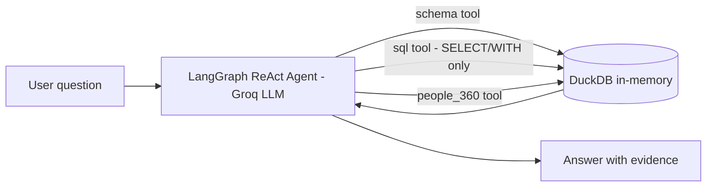

# 👥 Account People 360 — AI Relationship Intelligence Assistant

A conversational assistant that lets an account team **chat with their relationship data** —
who the key stakeholders are, how engaged they are, who's at risk, and where to focus this week —
instead of digging through spreadsheets and CRM exports.

Built with **LangChain / LangGraph** (agent orchestration), **DuckDB** (fast, deterministic SQL
analysis), and **Groq** (low-latency LLM inference).

---

## 1. Executive Summary (why this matters)

Account teams sit on rich stakeholder data — contacts, interaction logs, org relationships,
open opportunities — spread across CRM exports and spreadsheets. Nobody has time to manually
cross-reference all of it before a QBR or renewal conversation.

**This tool turns that data into an ask-a-question interface.** A director can type
*"Who should I prioritize this week?"* and get a ranked, evidence-backed answer in seconds,
grounded entirely in the underlying data — not a guess from the LLM.

**Key differentiator:** the LLM never invents numbers. Every fact, count, ranking, or date comes
from a live SQL query against the data (via DuckDB). The LLM's job is to understand the question,
call the right query, and explain the result in plain English. This makes the answers auditable
and trustworthy enough to bring into a leadership conversation.

### Business value
- **Faster prep** — seconds instead of manual spreadsheet triage before customer meetings.
- **Consistent judgment** — every user gets the same rigor (recency, influence, open pipeline)
  applied to "who matters most," not gut feel.
- **Early risk detection** — surfaces cooling relationships and decision-makers who haven't been
  engaged before they become renewal problems.
- **Zero data science lift** — runs on a plain Excel export; no data warehouse required to start.

### Suggested rollout / pitch to leadership
1. **Pilot on one account team** with the included synthetic data to demonstrate the experience risk-free.
2. **Swap in one real account's export** (People/Interactions/Opportunities/Relationships) once the format is validated.
3. **Measure**: time saved in pre-meeting prep, number of at-risk relationships caught early.
4. **Scale**: connect directly to CRM (Salesforce/Dynamics) instead of manual Excel export, add SSO/RBAC (see [Production checklist](#7-production-checklist)).

---

## 2. The Data

The app reads a single Excel workbook with **4 sheets**, joined by `person_id`. The repo ships a
150-person **synthetic** sample (`data/sample_account_people.xlsx`) so you can try it immediately
without any real customer data.

### Sheet: `People` (150 rows) — who the stakeholders are
| Column | Description |
|---|---|
| `person_id` | Unique key (e.g. `P001`), joins to all other sheets |
| `name` | Stakeholder name |
| `title` | Job title (e.g. "Chief Procurement Officer") |
| `level` | Seniority (`Executive`, `Director`, `Manager`, ...) |
| `department` | Function (Security, Procurement, Product, ...) |
| `location` | Region/country |
| `account_role` | Their role toward us (`Champion`, `Influencer`, `Technical Contact`, ...) |
| `status` | Current standing (`Active`, `Recently Promoted`, ...) |

### Sheet: `Interactions` (500 rows) — engagement history
| Column | Description |
|---|---|
| `interaction_id` | Unique key |
| `person_id` | Links to `People` |
| `date` | When the touchpoint happened |
| `type` | Channel (`Email`, `Workshop`, `Call`, ...) |
| `owner` | Which rep/CSM ran it |
| `topic` | Subject discussed |
| `sentiment` | `Positive` / `Neutral` / `Negative` |
| `outcome` | Result (`Follow-up`, `No response`, `Shared material`, ...) |
| `next_action` | Suggested follow-up, if any |

### Sheet: `Opportunities` (60 rows) — pipeline tied to people
| Column | Description |
|---|---|
| `opportunity_id` | Unique key |
| `person_id` | The stakeholder tied to this deal |
| `opportunity` | Deal name |
| `stage` | Sales stage (e.g. `Negotiation`) |
| `value` | Deal value ($) |
| `probability` | Win probability (%) |
| `close_date` | Expected close |
| `owner` | Deal owner |

### Sheet: `Relationships` (150 rows) — org structure & influence
| Column | Description |
|---|---|
| `person_id` | Links to `People` |
| `reports_to` | Manager's `person_id` (org hierarchy) |
| `influence_level` | `Low` / `Medium` / `High` |
| `relationship_strength` | `Weak` / `Strong` |
| `champion` | `Yes`/`No` — actively advocates for us |
| `decision_maker` | `Yes`/`No` — has budget/sign-off authority |

To use your own data, export/format your CRM data into the same 4 sheets with matching column
names and `person_id` keys, then upload it from the sidebar (no code changes needed).

---

## 3. How to Chat With It

Open the app, type a question in plain English in the chat box (or click a suggested question in
the sidebar), and the agent will query the data and respond with a concise, evidence-based answer.

### Sample questions to try
- "Who should I prioritize this week?"
- "Show me people who have not been contacted in 60 days."
- "Who are the decision makers?"
- "Which people are connected to our biggest opportunities?"
- "Give me a People 360 summary for Sarah Lee."
- "Give me an account people summary."
- "Which relationships are at risk?"
- "Show me top opportunities with weak executive engagement."
- "Which champions haven't we talked to recently?"
- "Rank departments by total open pipeline value."
- "Who reports to David Kumar, and how strong are those relationships?"
- "What's the sentiment trend for our last 5 interactions with each champion?"

### Follow-up / multi-turn questions
The agent remembers the current conversation, so you can drill in naturally:
- "Who should I prioritize this week?" → *"...and what about just the Security department?"*
- "Give me a People 360 summary for Sarah Lee." → *"...has her sentiment been trending up or down?"*

---

## 4. How It Works (architecture)

- **LangChain / LangGraph agent** (`app/agent.py`): a `create_react_agent` equipped with three tools:
  - `schema` — lists tables/columns so the agent knows what's queryable.
  - `sql` — runs a read-only `SELECT`/`WITH` query against DuckDB (writes are blocked).
  - `people_360` — a pre-built lookup for a single person's consolidated profile.
- **DuckDB** (`app/data_loader.py`): loads the 4 Excel sheets into in-memory tables and performs
  all joins, filters, aggregations, and ranking — never the LLM.
- **Groq LLM**: interprets the question, decides which tool(s) to call, and writes the final
  natural-language answer from the tool results only.
- **Streamlit** (`app.py`): chat UI, file upload, and example-question shortcuts.

### Why the LLM doesn't calculate anything itself
Business numbers (counts, totals, days-since-contact, rankings) are computed deterministically by
DuckDB SQL. The LLM only reads the query results and explains them. This avoids the classic LLM
failure mode of hallucinated statistics, which matters when the output goes in front of a director.

---

## 5. Efficiency Notes (what was optimized, and how to use it efficiently)

Two things were tuned so the app is fast and cheap to run in a live conversation:

1. **Data & agent are cached, not rebuilt per message.** `st.cache_resource` keeps the DuckDB
   connection and the compiled LangGraph agent alive across turns — they're only rebuilt when you
   upload a new workbook. Previously, every single question reloaded the Excel file and recompiled
   the agent graph from scratch, which is wasted latency and cost.
2. **Conversation memory via a checkpointer, not full history replay.** The agent uses a
   `MemorySaver` checkpoint keyed by a per-session `thread_id`. Only the *new* question is sent to
   the agent each turn; LangGraph recalls prior turns for that thread itself. This keeps token usage
   low on long conversations instead of resending the entire chat history every time.

### Tips for efficient day-to-day use
- Ask **specific, scoped questions** ("...for the Security department") rather than very broad ones — narrower SQL is faster and cheaper.
- Use **follow-ups** instead of restating context — the agent remembers the thread.
- **Reuse the sample data to demo**, and only upload a real workbook when you're ready to analyze it (uploading resets the conversation memory, since the underlying data changed).
- Keep `GROQ_MODEL` set to a fast/cheap model (default `openai/gpt-oss-120b`) for interactive use; reserve larger models for deep, one-off analysis if needed.

---

## 6. Quick Start

1. Install Python 3.10+.
2. Create a virtual environment:
   - Windows: `python -m venv .venv` then `.venv\\Scripts\\activate`
   - macOS/Linux: `python3 -m venv .venv` then `source .venv/bin/activate`
3. Install: `pip install -r requirements.txt`
4. Copy `.env.example` to `.env`.
5. Get a Groq API key from https://console.groq.com/ and put it in `.env`.
6. Run: `streamlit run app.py`
7. Open the local Streamlit address and start chatting.

---

## 7. Production Checklist

Before pointing this at real organizational data, add:
- SSO/RBAC and audit logs for who asked what.
- Approved data handling / data residency review with security & legal.
- Source-row references in answers (so a claim can be traced to the exact record).
- Controlled storage (no ad-hoc Excel uploads) — ideally a direct, read-only CRM connection.
- Rate limiting / cost controls on LLM calls.

Treat generated recommendations as **decision support**, not authoritative HR or personnel judgments.
